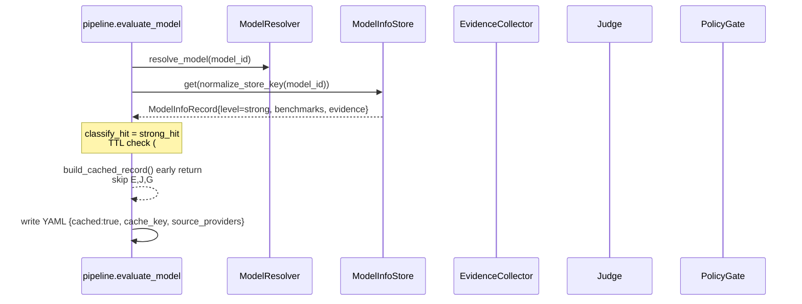
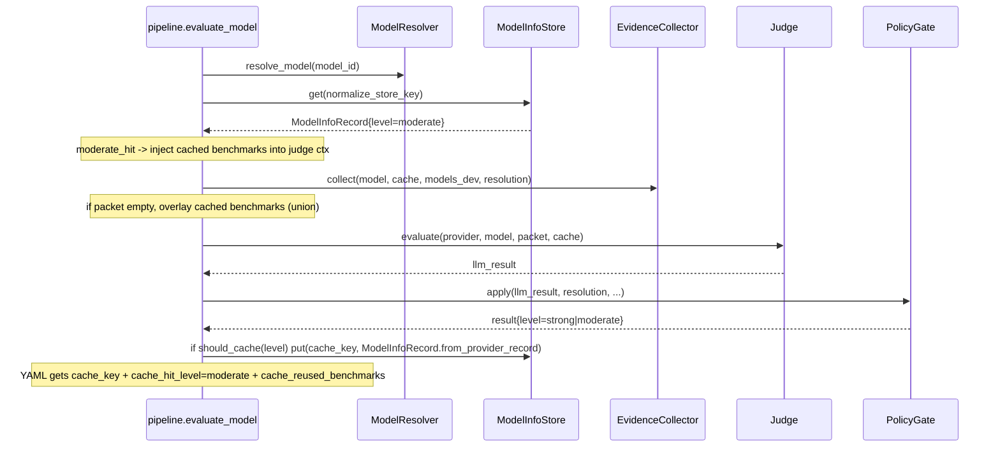
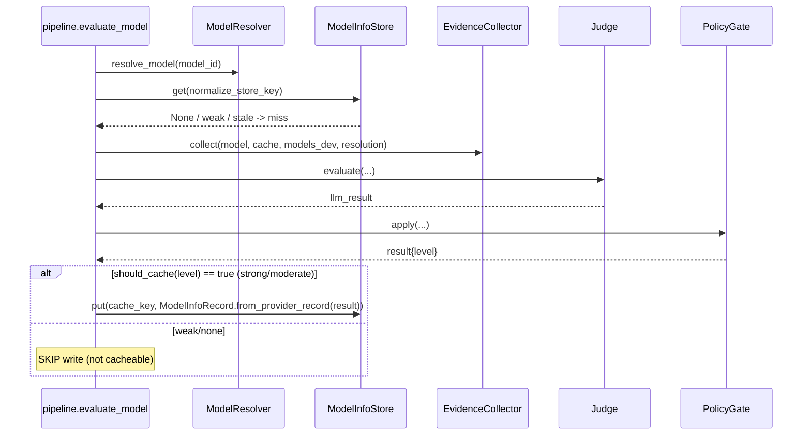

# Prototype #67 — Pipeline seam & reuse flow: where cache hits

**Status:** throwaway prototype — HITL review needed before build  
**Blocked by:** Store schema #66 ✅ done → this ticket wires seam  
**Persistence/TTL owned by:** #68 (this prototype uses in-memory stub, no TTL enforcement)

## Decision — seam location

**Inject in `pipeline.evaluate_model` as early return after `resolve_model`, before `EvidenceCollector.collect`.**

- `ModelInfoStore` queried immediately after `resolve_model` (needs `cache_key = normalize_store_key(model_id)`).
- **Not** wrapping `ModelResolver` alone — resolver lacks benchmark/evidence context needed for hit policy (strong vs moderate).
- **Not** after `EvidenceCollector` — strong hit should skip collector + judge entirely (token + latency saving). Moderate hit still needs collector but can inject cached benchmarks.

Single seam, one dict lookup, no change to the four adapters' signatures.

## Hit / miss policy

| Cached `evidence_level` | Action | Judge | Benchmarks |
|---|---|---|---|
| `strong` | **strong_hit**: early return, skip collector + judge | skipped | reused from store |
| `moderate` | **moderate_hit**: run collector, inject cached benchmarks into judge context, still call judge + gate | called | reused (union if packet empty) |
| `weak` / `none` / miss | **miss**: full pipeline (`collect → judge → gate`) | called | fresh |
| stale (if #68 defines TTL, e.g. >90d) | treated as miss | — | — |

Rationale: #64 says cache gate is strong/moderate only; weak records never enter store. Moderate still benefits from judge re-evaluation (evidence may have strengthened). Strong is safe to skip judge.

## Miss write-back

After full `PolicyGate.apply`:

- `should_cache(evidence_level)` per `model_info_store.CACHEABLE_LEVELS` → only `strong`/`moderate` written.
- Fields per `FIELD_INCLUSION_MATRIX` (aa_model_id, aa_score, coding_score, benchmarks, evidence, confidence, tier, pricing, _meta). Weak/none → no insert.
- Provenance `StoreMeta.source_providers` / `source_evidence_levels` merged (sorted set + append), `last_updated = now`, `first_seen` preserved.
- Pricing aggregation per #65 (mean of non-outliers, outliers → `per_provider_overrides`) happens on read/merge, not on single write.
- Staleness: no TTL enforcement in this prototype; stub `is_stale()` present for #68 to replace with real policy. Until #68, 3-month-old strong evidence still reuses (explicit gap).

## Output YAML provenance

When reuse occurs, `ProviderBatchWriter` record gets:

```yaml
cached: true              # strong_hit only; moderate_hit => cached: false + cache_reused_benchmarks: true
cache_key: "gpt-4o"       # normalized key (normalize_store_key)
cache_hit_level: strong   # strong | moderate
source_providers: ["openai", "openrouter"]
cache_reused_benchmarks: true  # moderate only
```

Weak/miss records get no `cached` field. Keeps existing `keep/drop_llm/error` lists shape-compatible; gateway consumption unchanged.

## Flow diagrams

### Sequence — strong hit (skip judge)



### Sequence — moderate hit (reuse benchmarks, still judge)



### Sequence — miss (full pipeline + conditional write)



## File seams

```
src/llm_discovery/pipeline.py      # evaluate_model — insert 6-line block after resolve_model:
                                   #   cache_key = normalize_store_key(model_id)
                                   #   cached = store.lookup(model_id) if store else None
                                   #   if classify_hit(cached)=="strong_hit" and not stale: return build_cached_record(...)
                                   # passes store: PrototypeStore | ModelInfoStore (injected by discover_* entry points)

src/llm_discovery/model_resolver.py # NOT wrapped — no store access; remains deterministic
src/llm_discovery/model_info_store.py # owns normalize_store_key, should_cache, ModelInfoRecord, StoreMeta
src/llm_discovery/pipeline_cache_prototype.py # throwaway stub (this ticket) — in-memory PrototypeStore +
                                   # evaluate_model_with_cache_prototype() showing exact wiring
```

## Open questions for HITL review

1. **Moderate policy:** reuse benchmarks but still judge — agree, or should moderate also skip judge when confidence > threshold?
2. **Deterministic drops:** should `deterministic_drop_record` with `evidence_level=strong` populate store? Prototype does (optional). If not, vision/TTS drops never cache.
3. **TTL:** prototype treats 3-month-old strong as reuse. #68 must decide TTL (90d? 180d? no TTL, provider drift only?). Until then, staleness gap stays.
4. **Concurrency:** parallel `discover_all_providers` writing same `model_info_store.json` — need file lock (see #63 "not yet specified"). Prototype uses in-memory, no lock.
5. **Backfill:** 15+ existing YAMLs → bulk `ModelInfoRecord.from_provider_record` + `should_cache` filter. Idempotency via `normalize_store_key` dedup.

## How to run prototype stub

```python
from llm_discovery.pipeline_cache_prototype import PrototypeStore, evaluate_model_with_cache_prototype

store = PrototypeStore()
# first call: miss -> full pipeline -> maybe WRITE
r1 = evaluate_model_with_cache_prototype(model, provider, aa, models_dev, evaluator, 0.5, 1.0, cache, store)
# second call same model different provider: strong_hit -> skip judge
r2 = evaluate_model_with_cache_prototype(model2_same_name, other_provider, aa, models_dev, evaluator, 0.5, 1.0, cache, store)
assert r2["cached"] is True
```

No prod code changed; prototype lives on branch `prototype/cache-seam-67`.
